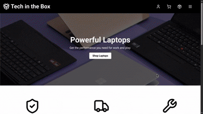

# Tech in the Box

**Tech in the Box** is a basic e-commerce website for gadgets, built as a final project for my Information Management course during my sophomore year. Made with React, FastAPI, and MySQL for the database.

## Demo



## Features

* Browse and order products by category (phones, laptops, accessories)
* User registration and login with JWT authentication
* Admin dashboard to manage products, orders, and users

## Getting Started

### Prerequisites

* [Docker](https://www.docker.com/get-started/)
* [Docker Compose](https://docs.docker.com/compose/install/) 

### Setup

1. **Clone the repository**

```bash
git clone https://github.com/Augustus1417/Tech-In-The-Box.git
cd Tech-In-The-Box
```

2. **Make the setup script executable** (Linux/macOS)

```bash
chmod +x setup.sh
```

3. **Run the setup script**

```bash
./setup.sh
```

This will build and start all services: backend, frontend, and the MySQL database, with everything configured.

---

## Admin Access

The project includes a preloaded admin account for testing purposes:

* Email: [admin@gmail.com](mailto:admin@gmail.com)
* Password: 123

## Notes
* The setup script handles building and running Docker containers.
* The backend automatically waits for the database to initialize before starting.
* This project is for **educational purposes only** and is not production-ready.

---
